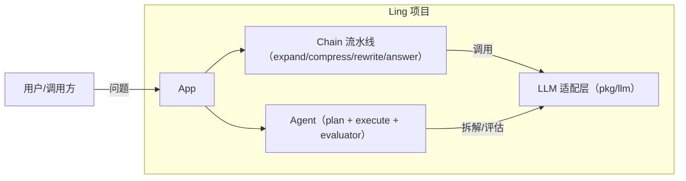
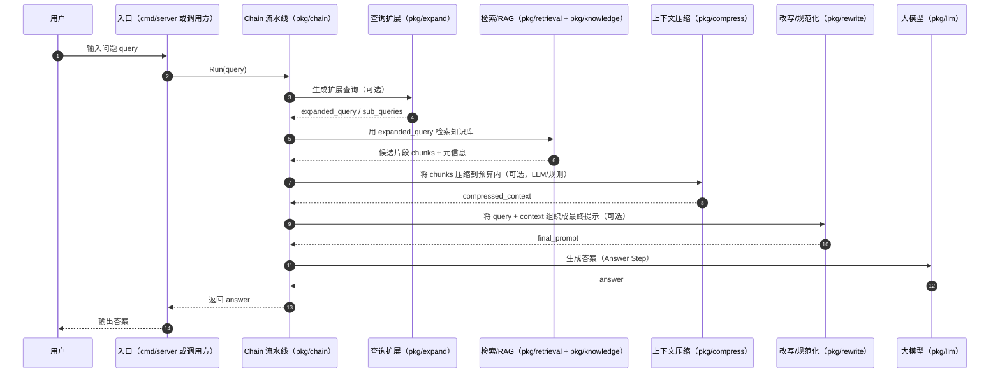
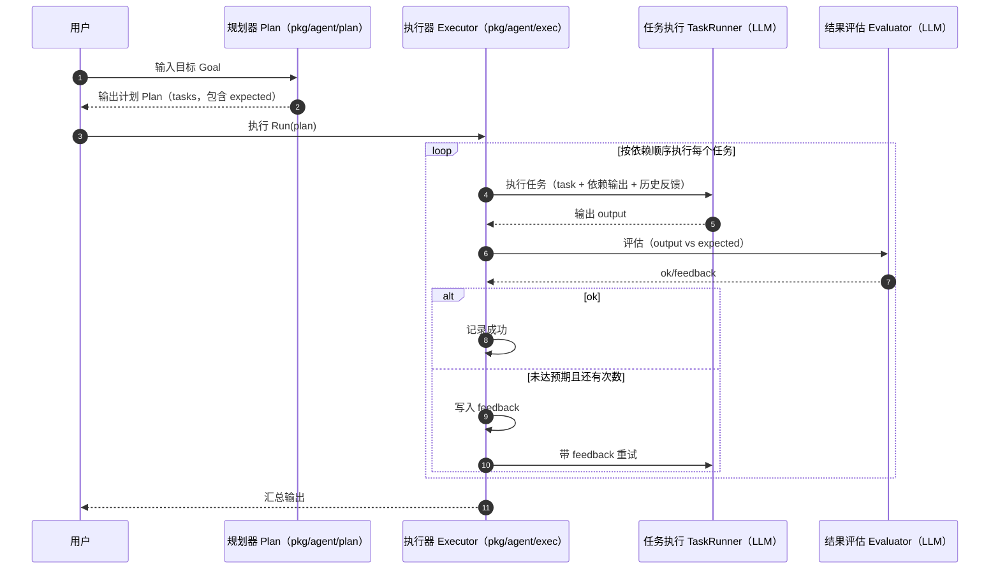

# 架构说明

## 组件概览

```mermaid
flowchart LR
  U[用户/调用方] -->|问题| App

  subgraph LingProj[Ling 项目]
    Chain[Chain 流水线（expand/compress/rewrite/answer）]
    Agent[Agent（plan + execute + evaluator）]
    LLM[LLM 适配层（pkg/llm）]

    App --> Chain
    App --> Agent

    Chain -->|调用| LLM
    Agent -->|拆解/评估| LLM
  end
```

## 管道模式：LLM + RAG + 组件化处理流程（不包含 Agent）

```mermaid
sequenceDiagram
  autonumber
  participant User as 用户
  participant API as 入口（cmd/server 或调用方）
  participant Chain as Chain 流水线（pkg/chain）
  participant Expand as 查询扩展（pkg/expand）
  participant Retrieve as 检索/RAG（pkg/retrieval + pkg/knowledge）
  participant Compress as 上下文压缩（pkg/compress）
  participant Rewrite as 改写/规范化（pkg/rewrite）
  participant LLM as 大模型（pkg/llm）

  User->>API: 输入问题 query
  API->>Chain: Run(query)

  Chain->>Expand: 生成扩展查询（可选）
  Expand-->>Chain: expanded_query / sub_queries

  Chain->>Retrieve: 用 expanded_query 检索知识库
  Retrieve-->>Chain: 候选片段 chunks + 元信息

  Chain->>Compress: 将 chunks 压缩到预算内（可选，LLM/规则）
  Compress-->>Chain: compressed_context

  Chain->>Rewrite: 将 query + context 组织成最终提示（可选）
  Rewrite-->>Chain: final_prompt

  Chain->>LLM: 生成答案（Answer Step）
  LLM-->>Chain: answer

  Chain-->>API: 返回 answer
  API-->>User: 输出答案
```

## Agent：Plan/Execute + ReAct 重试闭环

```mermaid
sequenceDiagram
  autonumber
  participant User as 用户
  participant Planner as 规划器 Plan（pkg/agent/plan）
  participant Exec as 执行器 Executor（pkg/agent/exec）
  participant Runner as 任务执行 TaskRunner（LLM）
  participant Eval as 结果评估 Evaluator（LLM）

  User->>Planner: 输入目标 Goal
  Planner-->>User: 输出计划 Plan（tasks，包含 expected）

  User->>Exec: 执行 Run(plan)

  loop 按依赖顺序执行每个任务
    Exec->>Runner: 执行任务（task + 依赖输出 + 历史反馈）
    Runner-->>Exec: 输出 output

    Exec->>Eval: 评估（output vs expected）
    Eval-->>Exec: ok/feedback

    alt ok
      Exec->>Exec: 记录成功
    else 未达预期且还有次数
      Exec->>Exec: 写入 feedback
      Exec->>Runner: 带 feedback 重试
    end
  end

  Exec-->>User: 汇总输出
```
